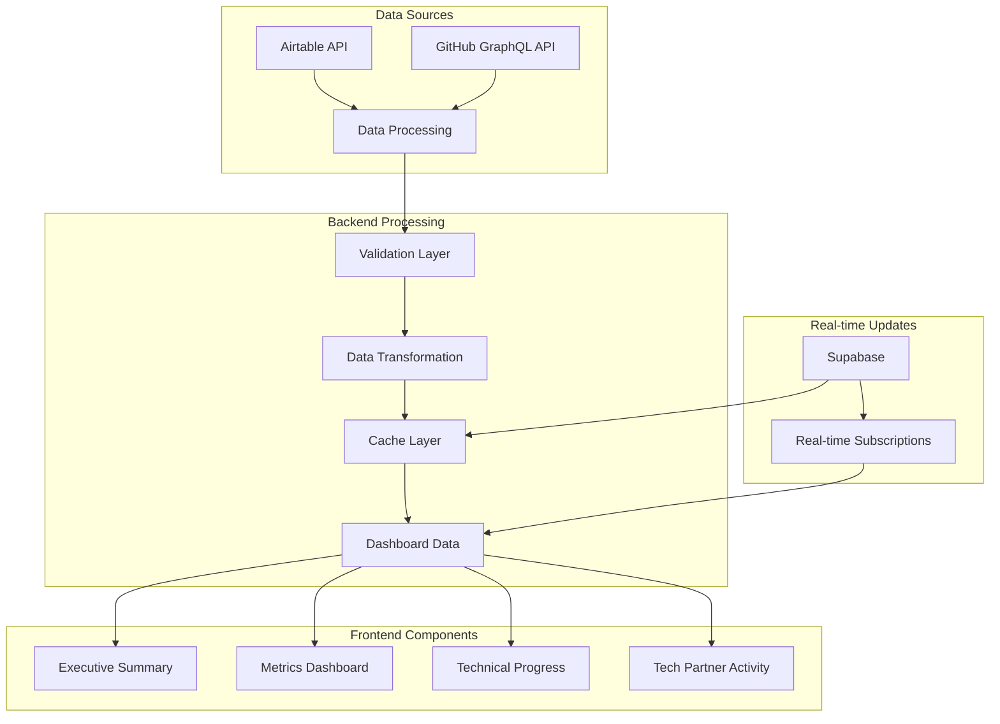
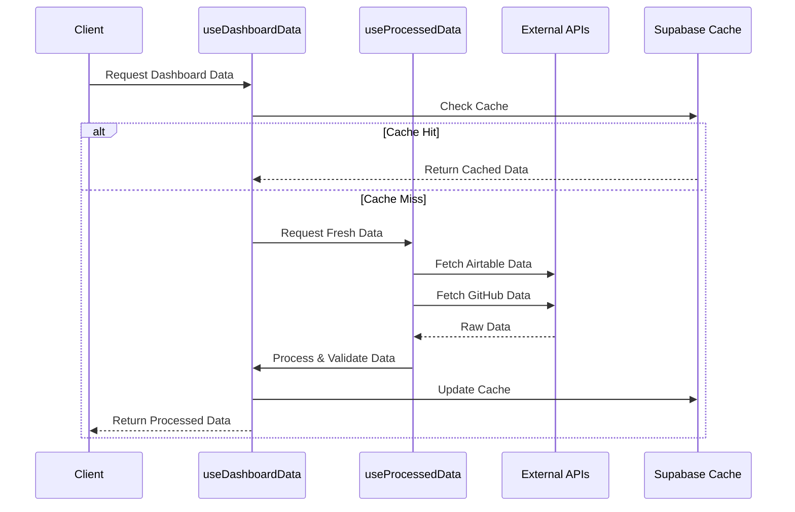

# PLDG Dashboard Architecture

## System Overview

## Data Pipeline

## Key Components

1. **Data Fetching Layer**
   - `useGitHubData`: GitHub GraphQL API integration
   - `useAirtableData`: Airtable API integration
   - Circuit breaker pattern for API resilience
   - Retry logic with configurable attempts

2. **Data Processing**
   - `useProcessedData`: Combines and processes raw data
   - `processEngagementData`: Transforms engagement metrics
   - Type-safe data transformation
   - Zod schema validation

3. **Caching Layer**
   - Supabase for data persistence
   - 5-minute cache duration
   - Automatic cache invalidation
   - Real-time subscriptions

4. **Dashboard Components**
   - Executive Summary
   - Engagement Trends
   - Technical Progress
   - Tech Partner Activity
   - Top Contributors

## Data Flow Architecture

1. **Initial Load**
   - Check Supabase cache
   - Fetch from APIs if cache miss
   - Process and validate data
   - Update cache with new data

2. **Real-time Updates**
   - Subscribe to Supabase changes
   - Trigger cache cleanup
   - Transform new data
   - Update UI components

3. **Error Handling**
   - Circuit breaker for API failures
   - Retry logic for transient errors
   - Fallback values for missing data
   - Type-safe validation

## Performance Optimizations

1. **Caching Strategy**
   - 5-minute cache TTL
   - Automatic cleanup of expired cache
   - Deduplication of requests
   - Real-time invalidation

2. **Data Processing**
   - Memoized transformations
   - Type-safe validations
   - Efficient data structures
   - Optimistic updates

3. **UI Components**
   - Lazy loading
   - Memoized calculations
   - Default fallback values
   - Loading states

## Tech Stack

- Next.js
- TypeScript
- Supabase
- Tailwind CSS
- Recharts
- SWR
- Zod
